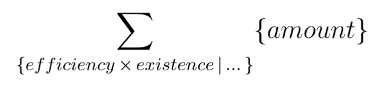
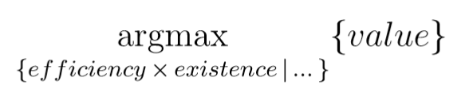

## Accounting data management: use case invariant considerations

In a modern IT system, all business entities are striving for account-based data management. This will ensure that all business transactions in the history can be traced meticulously, and we also have the flexibility to carry out business transactions in the past and future at any time (keyword: retroactive changes). In a modern development environment, there is also the chance to implement the relevant considerations once and to reuse them for any useful application without additional effort.

Generically, one can consider that every business entity is divided into three parts:

")

The fields VID, KID, DID are technical key fields in the form of a UUID (globally unique, without order relation) or in form of a big Integer. The (first) letter V stands for **validity**, K for **key** and D for **data**. As indicated in the diagram, there are three tables in the relational database model.

#### Validity

It is immediately apparent that the validity is completely independent of the use case and therefore only needs to occur once for all business entities in the respective technical service context.

* The **efficiency** is a time specification which, according to its name, makes a statement as to whether dependent data within a certain factual context must be taken into account. It is an "included start" ( = "effective from included") in the form of a date, time or time stamp. At the moment it is not yet clear to me what granularity is required here.
* The **existence** is a time specification in the form of a time stamp that is as fine-grained as possible. It makes the statement from when dependent data have existed. In other words, it is the point in time when an employee, a customer, a program created this data record.

#### Business Key

The business key is the factually defining dimension or set of such dimensions that defines the business data in more detail. Usually, in our context, a field such as policy holder number, contract, etc. will appear here. The business key has no immediate validity. A time reference can be indirectly established via the business data assigned to it. This makes sense because a business key without business data has no right to exist.

#### Business Data

The business data is dependent data that must be assigned by force to a business key characteristic and can be aggregated in some form (such as amounts). In addition to the reference to a transaction key, they also have a reference to a validity.

#### Assumptions

* Only insertions are permitted. Changes and deletions are prohibited.
* Since the validity fields only represent a beginning in each case, all business changes up to complete deletion must be realised via aggregates.
* Aggegrate types depend on the business purpose of a field, see examples.

| currency amounts | others |
|------------------|--------|
|  |  |

* Where do business foreign keys belong? It depends:
    * A foreign key with reference to a "business change" belongs in the business data.
    * A foreign key with reference to all data records with the same key belongs in the business key. In this case it has the "content severity" of the business key.
	
#### Implementation

The whole thing can be developed with Java Generics in the form of a linkable utility library. In this way, the application developer can be provided with complete CRUD functionality without having to learn the schema of data storage. Of course, there must be an understanding of the terms of validity - but otherwise the application developer can speak of "change sentence" or "delete sentence".